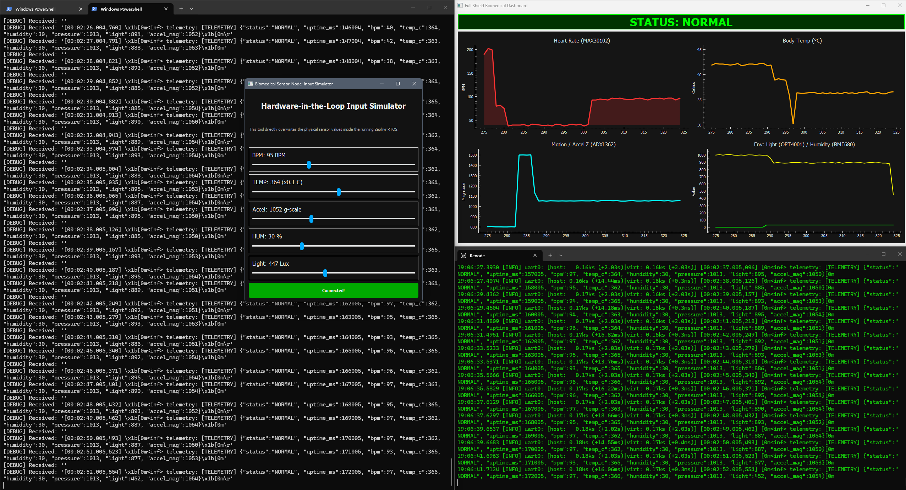

# Biomedical Sensor-Node Digital Twin

A fully interactive, end-to-end "Hardware-in-the-Loop" emulation of a biomedical sensor node. This project demonstrates how modern RTOS development can be decoupled from physical hardware using Zephyr and Renode.

The goal? To build a system that acts, fails, and recovers just like a real medical wearable—but entirely in software.

## What it does

This project simulates a wearable health monitor running on a virtual nRF52840 MCU. The firmware is written in C using the Zephyr RTOS and continuously samples mock data (Heart Rate, Motion, Temperature, etc.).

Instead of just printing logs, the virtual hardware is fully interactive:
- **Zephyr RTOS**: Manages a Finite State Machine (FSM) that monitors patient vitals and triggers alarms (e.g., Tachycardia) if anomalies are detected.
- **Renode Emulation**: Runs the compiled ARM firmware natively on your machine, managing virtual UART and memory buses.
- **The Dashboard**: A real-time Python/PyQt GUI that visualizes the JSON telemetry streaming out of the virtual microcontroller. 
- **The Input Simulator**: A secondary PyQt GUI that injects hardware interrupts back *into* the simulation. Slide the Heart Rate slider up, and watch the RTOS instantly detect the anomaly and trigger the alarm state on the dashboard.

## Why build this?

Developing firmware for embedded systems is notoriously painful. You wait for hardware boards to ship, deal with faulty wires, and struggle to reproduce edge-case bugs. 

By building a complete "Digital Twin", we can:
- **Test continuously (CI/CD)**: Our GitHub Actions pipeline automatically boots the Renode emulator and uses Robot Framework to inject anomalies and assert correct RTOS behavior.
- **Develop rapidly**: Write, compile, and test hardware-level logic without ever touching a physical board.
- **Simulate the impossible**: Safely inject catastrophic sensor failures and medical anomalies (like extreme Tachycardia) to guarantee the software responds safely.

## Tech Stack
- **Firmware**: Zephyr RTOS (C)
- **Emulation**: Renode
- **Visualization**: Python, PyQt5, PyQtGraph
- **CI/CD**: GitHub Actions, Robot Framework

## System Preview

